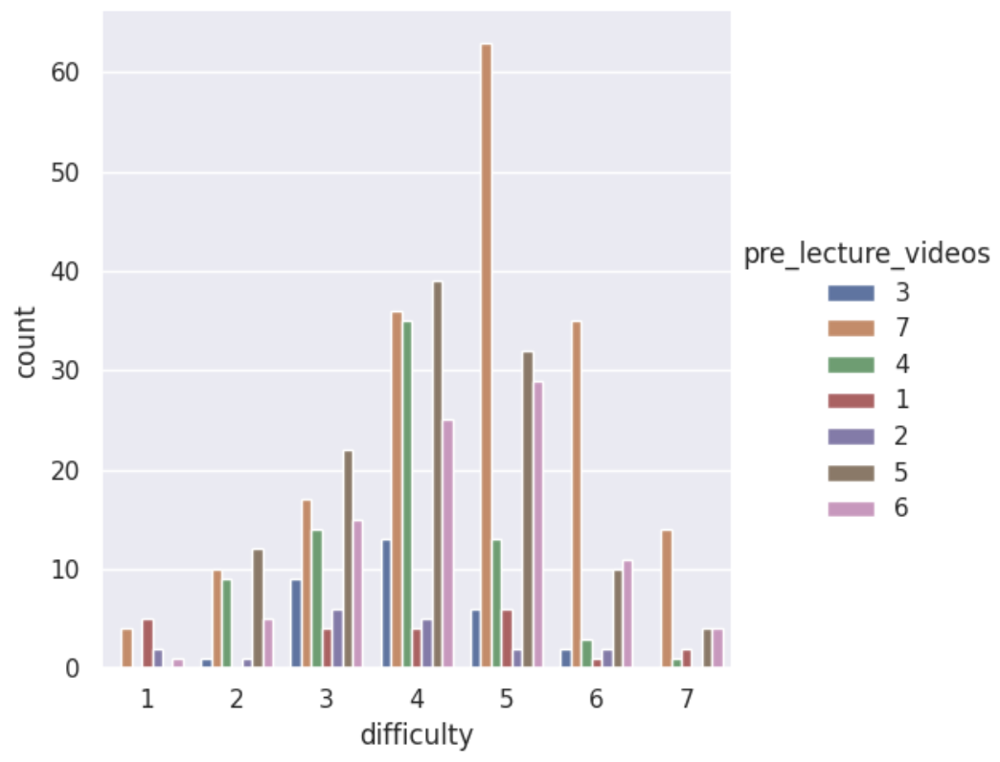
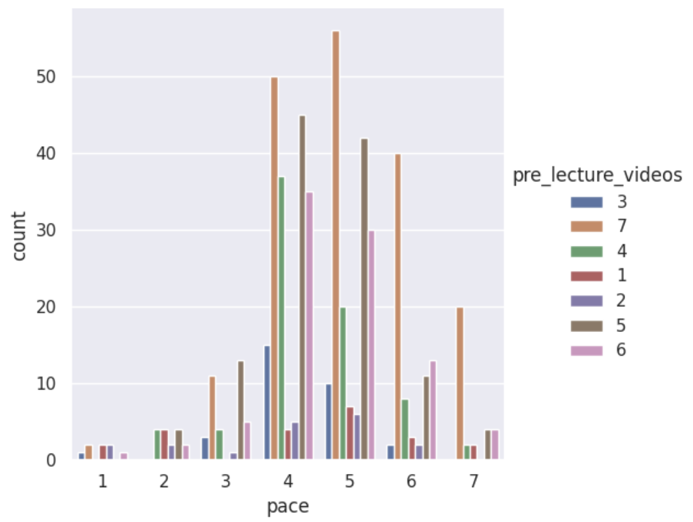
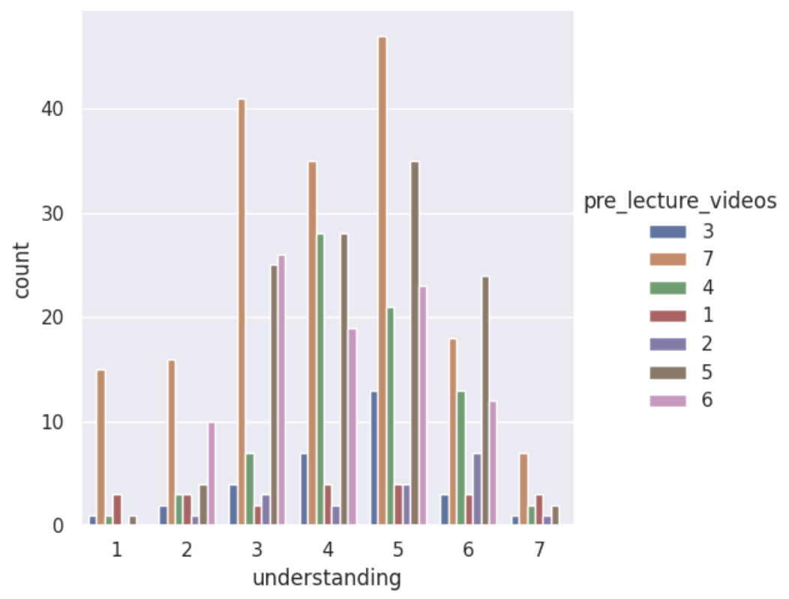

# Analysis

## Step 1: Select Relevant Columns

We analyze whether students who find the course difficult, fast-paced, or hard to understand are more likely to want pre-lecture videos.

We load the survey data and focus on the following variables:
- pre-lecture videos  
- difficulty  
- pace  
- understanding  

---

## Step 2: Counting Response Frequencies

We compute the frequency of responses for each variable to understand how student answers are distributed.

This helps identify patterns before deeper analysis.

---

## Step 3: Difficulty vs Interest

We analyze how perceived difficulty relates to interest in pre-lecture videos.

Students who report higher difficulty tend to show more interest in pre-lecture videos. However, even students with moderate difficulty still show interest, suggesting these videos benefit a wide range of students.

---

## Step 4: Pace vs Interest

We examine how course pace influences interest in pre-lecture videos.

Students who perceive the course as faster-paced tend to have higher demand for pre-lecture videos. This suggests videos help students keep up with the material.

---

## Step 5: Understanding vs Interest

We investigate the relationship between understanding and interest in pre-lecture videos.

Students with lower levels of understanding show higher interest in pre-lecture videos. This indicates that these resources are especially useful for students who are struggling.

---

## Conclusion

Overall, students who perceive the course as more difficult, fast-paced, or harder to understand are more likely to want pre-lecture videos.

Pre-lecture videos can help students better prepare and improve their understanding, especially for those who need additional support.
